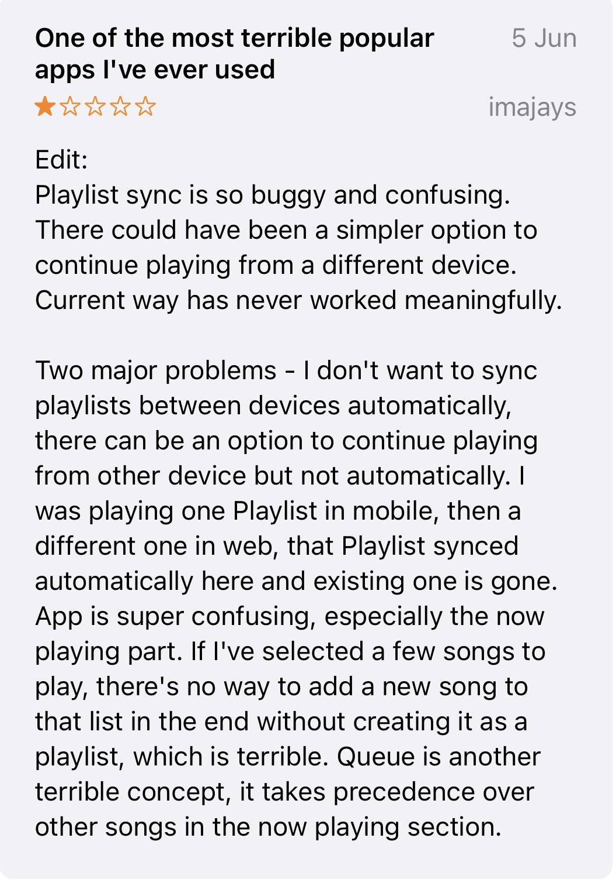
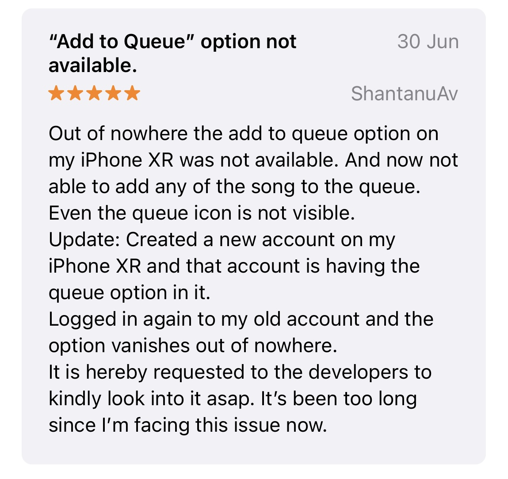
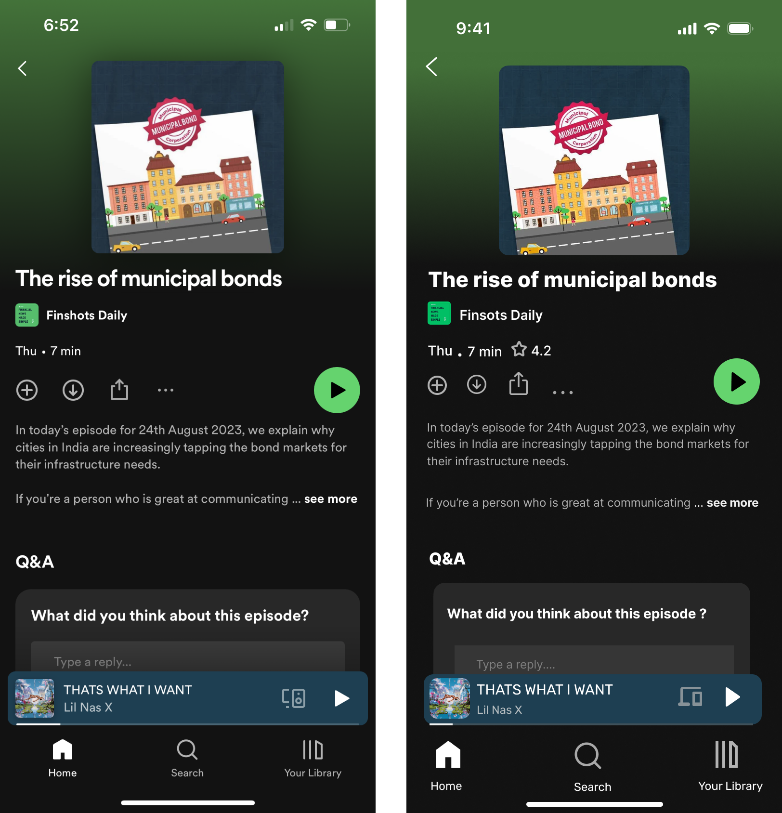

# A UX/UI Case Study on Spotify

## Project Title

Founded in 2006, Spotify has redefined how we experience music. It's like having a massive music collection and personalised playlists right at your fingertips. Yet, while it's a fantastic platform, there's room for improvement in enhancing the overall user experience.

## Project Overview

This case study focuses on identifying and addressing user experience problems and navigation issues on the Spotify music streaming platform. The project aims to enhance specific features for a more user-centric and engaging Spotify experience. It will involve user research, design, development, and ongoing user feedback analysis. Success will be measured by the platform's improved usability and user satisfaction.

## **Why the redesign ?**

I am designing this app with a clear purpose and vision, driven by user feedback, personal experience, and comparative research between popular music streaming platform Apple Music  Here's why I believe this app is essential:

**1. User Feedback and Pain Points:**

- After extensive research, I collected valuable insights from user feedback on existing music streaming apps available on the App Store. Users consistently expressed specific pain points and frustrations.

**2. Comparative Analysis:**

- I conducted in-depth comparisons between Apple Music, Spotify, and my own experiences. These comparisons highlighted several areas where the existing platforms could be improved to better meet user needs and expectations.

**3. User-Centered Design Philosophy:**

- My approach to app design is rooted in user-centered principles. I firmly believe that the best apps are those that prioritise user needs and experiences above all else.

## **Role & Project Duration**

**One week** 

**UX Researcher and Designer**

In this project, I undertook the roles of a UX researcher and designer, dedicating one week to conduct user research, design improvements, and analyze user feedback for the Spotify platform."

## The Problem

1. **Issue:** Podcast Episodes Lack Personal Ratings
    - **Description:** It's hard to find individual ratings for podcast episodes, making it tricky to discover top-quality content.
2. **Issue:** Queue Management Limitations
    - **Description:** Spotify doesn't let you choose whether newly added songs play at the start or end of your queue, limiting your control over your listening experience.
3. **Issue:** Unwanted Device Sync
    - **Description:** Spotify automatically syncs across devices without asking, which can sometimes disrupt your listening when you'd like to use different devices at the same time.
4. **Issue:** Lack of Melody-Based Song Search
    - **Description:** "Spotify lacks a feature that allows users to sing or hum a tune when they can't recall the lyrics, hindering their ability to find and enjoy songs they love.”
5. **Issue:** Album Download Options
    - **Description:** Spotify doesn't offer a download button for individual songs within an album, meaning you have to download the entire album to enjoy specific songs offline, which could be more user-friendly.

## Goals

1. **Issue:** Podcast Episodes Lack Episode Ratings
    - **HMW Question:** How might we enhance podcast episode discovery on Spotify, given the absence of episode ratings?
2. **Issue:** Queue Management Limitations
    - **HMW Question:** How might we provide Spotify users with more control over song placement within their queues, improving their listening experience?
3. **Issue:** Unwanted Device Sync
    - **HMW Question:** How might we give users more control over device synchronization on Spotify to prevent disruptions when switching between devices?
4. **Issue:** Lack of Melody-Based Song Search
    - **HMW Question:** How might we assist users in finding song lyrics easily on Spotify, especially when they can't recall them?
5. **Issue:** Album Download Options
    - **HMW Question:** How might we make the song download process more flexible on Spotify, allowing users to download individual songs within an album?

## Design Process

In tackling these user experience challenges within Spotify, my design process followed a structured approach. It began with a comprehensive understanding of user pain points through user research, where I gathered insights into the limitations users face, such as queue management, device synchronisation, melody-based song search, and album download options. Armed with these insights, I formulated clear 'How Might We' questions to frame design challenges. The next step involved ideation and brainstorming, where I generated creative solutions tailored to each issue. These solutions were translated into user interface designs that considered user workflows and Spotify's existing design language. Following design, usability testing was conducted to assess the effectiveness of these solutions. The iterative nature of the process allowed for improvements based on user feedback. The final result was a set of user-centered design solutions poised to enhance the Spotify experience by addressing these identified issues.”

1. **Research:** Understand user pain points through research, identifying limitations in queue management, device synchronisation, melody-based song search, and album download options.
2. **Problem Framing:** Formulate clear "How Might We" questions based on research insights to frame design challenges.
3. **Ideation:** Generate creative solutions tailored to each issue through ideation and brainstorming.
4. **Design:** Translate solutions into user interface designs considering user workflows and Spotify's design language.
5. **Usability Testing:** Assess the effectiveness of solutions through usability testing.
6. **Iteration:** Refine designs based on user feedback in an iterative process.
7. **Result:** Deliver a set of user-centered design solutions aimed at enhancing the Spotify experience by addressing identified issues.

## **Solution**

**1. Personal Ratings for Podcast Episodes:**

- To address the difficulty in discovering top-quality podcast episodes, I propose the implementation of a rating and review system specifically for individual podcast episodes. This feature will empower users to rate and review episodes, providing valuable feedback to the podcasting community and helping others discover content that aligns with their preferences.

**2. Queue Management Enhancement:**

- To provide users with more control over their listening experience, I suggest introducing an option to choose whether newly added songs play at the start or end of the queue. This feature enables users to curate their playlists and queues with greater precision, ensuring a more personalized and enjoyable listening journey.

**3. Device Sync Customization with Acceptance Option:**

- To address the issue of unwanted device syncing, I propose implementing a user-controlled device synchronization feature with the added option for users to accept or decline sync requests. This empowers users with the flexibility to choose when and which devices should sync, ensuring that they can seamlessly switch between devices when desired without any disruption. When a sync request is initiated, users will receive a notification prompting them to accept or decline the synchronization. This feature enhances user control, respects their preferences, and provides a more tailored and interruption-free listening experience, aligning with Spotify's commitment to putting users in charge of their music journey.

**4. Melody-Based Song Search:**

- To cater to users who can't recall lyrics but remember a tune, I recommend the integration of a melody-based song search feature. This innovative tool will enable users to hum or sing a tune, and the app's algorithm will identify and suggest songs that match the melody, making music discovery more intuitive and enjoyable.

**5. Granular Album Download Options:**

- To enhance the download experience, I propose adding a download button for individual songs within an album. This feature will provide users with the flexibility to download only the songs they want, rather than the entire album, improving offline accessibility and user-friendliness.

## Result

In summary, while the design solutions outlined here have not yet been put into practice, we can envision the substantial potential impact they could have on Spotify's business landscape. Hypothetically, these user-centric enhancements encompassing refined queue management, the innovative introduction of a melody-based song search, resolution of sync-related issues, and the facilitation of individual song downloads within albums have the power to collectively revolutionise the platform's user experience.

These proposed enhancements could likely translate into a host of tangible benefits for Spotify:

**1. Elevated User Engagement:** By addressing the identified pain points, Spotify can create a more engaging and enjoyable user experience. Users who find the platform more intuitive and personalised are more likely to engage with it regularly.

**2. Enhanced User Satisfaction:** As users experience smoother navigation, easier song discovery, and greater control over their listening experience, overall satisfaction is expected to rise significantly.

**3. Improved User Retention:** Satisfied users are more likely to remain loyal to the platform, leading to improved user retention rates. This can be particularly valuable in a competitive market.

**4. Reduced Churn Rates:** The implementation of these enhancements may reduce the likelihood of users churning, as their needs and preferences are better addressed, thus fostering long-term user relationships.

**5. Increased Premium Subscriptions:** A more satisfying and seamless user experience can incentivise users to upgrade to premium subscriptions, resulting in increased revenue for Spotify.

**6. Promotion of New Features:** These enhancements can pave the way for the successful adoption of new features. When users are content with the core experience, they are more likely to explore and embrace additional features and services offered by Spotify.

While these potential impacts are hypothetical at this stage, they underscore the transformative influence that a user-focused design approach can have on Spotify's competitiveness in the ever-evolving music streaming industry. As Spotify continues to prioritise user needs and preferences, it is better poised to not only retain its user base but also attract new audiences, fortifying its position as a leading player in the digital music realm.